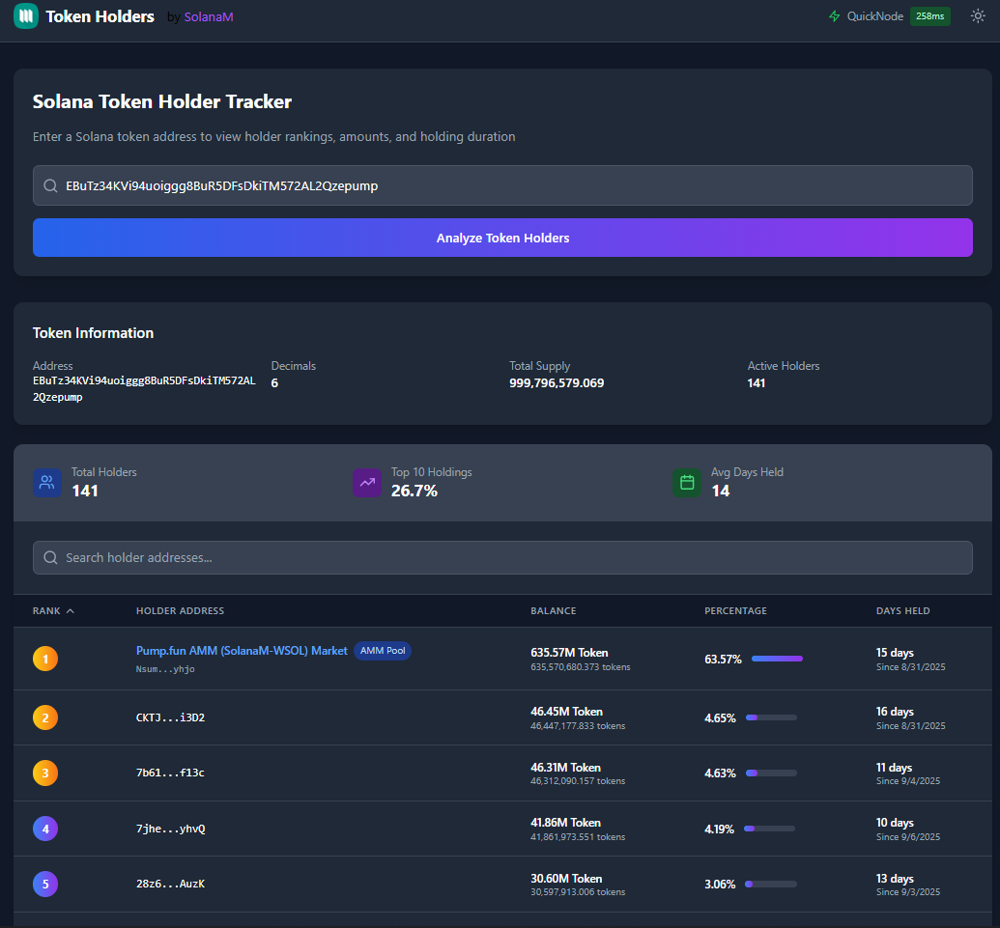

<div align="center">
  

  <p>
    <a href="https://react.dev"></a>
    <a href="https://www.typescriptlang.org/"></a>
    <a href="https://vitejs.dev/"></a>
    <a href="https://tailwindcss.com/"></a>
    <a href="https://solana.com/developers"></a>
    <a href="https://pnpm.io/"></a>
    <a href="#license"></a>
  </p>

  <p><strong>Tech stack:</strong> React + TypeScript + Vite + Tailwind · Solana Web3 RPC · Automatic endpoint failover</p>
</div>


## Solana Token Holder Tracker (Pump.fun Friendly)

A lightweight React + TypeScript + Vite app to analyze holders of any Solana SPL token. Optimized for Pump.fun launchpad tokens: paste a token mint address and see ranked holders with balances, percentages, and approximate holding duration.



### Features
- Holder list with ranks, balances, and percent ownership
- Token info: address, decimals, total supply, active holders counted from token accounts with non‑zero balances
- Basic “days held” estimation based on earliest token account signature
- Automatic RPC failover: pings multiple endpoints and uses the fastest
- Dark mode UI

## Getting Started

### Prerequisites
- Node.js 18+ and pnpm (recommended) or npm
- Solana mainnet RPC URLs (Helius, QuickNode, or your own). Replace demo keys with your own.

### Install
```bash
pnpm install
# or
npm install
```

### Run Dev Server
```bash
pnpm dev
# or
npm run dev
```

Vite will print a local URL. Open it in your browser.

### Build for Production
```bash
pnpm build
# or
npm run build
```

## How Holder Retrieval Works
- Given a token mint address, the app:
  - Fetches token metadata to get `decimals` and `supply` using `@solana/web3.js`
  - Queries `TOKEN_PROGRAM_ID` parsed accounts filtered by the mint to enumerate token accounts
  - Aggregates balances, sorts by balance desc, and computes percent ownership
  - For each account, requests up to 1000 signatures and estimates the first seen date to compute “days held” (best‑effort)

Relevant code: `src/services/solanaService.ts`.

## Changing RPC API Keys and Endpoints
The app uses multiple RPC endpoints and automatically selects the fastest one. Update the list here:

```12:25:src/services/solanaService.ts
const RPC_ENDPOINTS: RPCEndpoint[] = [
  {
    name: 'Helius',
    url: 'https://mainnet.helius-rpc.com/?api-key=**********************',
    ws: 'wss://mainnet.helius-rpc.com/?api-key=**********************',
    latency: null
  },
  {
    name: 'QuickNode',
    url: 'https://solitary-skilled-tab.solana-mainnet.quiknode.pro/****************************/',
    ws: 'wss://solitary-skilled-tab.solana-mainnet.quiknode.pro/****************************',
    latency: null
  }
];
```

- Replace the `url` and `ws` values with your own API keys.
- You can add or remove providers (e.g., Triton, Ankr, custom full node). Keep the same fields: `name`, `url`, `ws`, `latency`.
- The service pings each endpoint on startup (`getSlot`) and selects the lowest latency one. It also retries on errors and rotates endpoints.

Security note: Do not commit real API keys to public repos. Prefer environment variables or a secrets manager for production. (This demo keeps keys inline for simplicity.)

## Configuring Pump.fun Liquidity Pool/AMM Address
The service flags whether a holder is the Pump.fun AMM by checking a known owner address. Update it if Pump.fun changes infrastructure:

```27:33:src/services/solanaService.ts
private readonly PUMPFUN_AMM_ADDRESS = 'NsumZem3j76AAucwXzy5kpgpvqWJJW5dK68YwP6yhjo';
```

- Set this to the current Pump.fun AMM/market owner address if needed. When a token account’s `owner` equals this address, `isPumpfunAMM` is set true for that holder row.

## Using With Your Own Pump.fun Token
- Launch your token on Pump.fun as usual. Copy the token mint address from the success page or the site.
- Paste the mint address into the input on the app homepage and submit.

Optional: change the default placeholder mint shown in the input field here:

```10:15:src/components/TokenInput.tsx
const [tokenAddress, setTokenAddress] = useState('EBuTz34KVi94uoiggg8BuR5DFsDkiTM572AL2Qzepump');
```

## File Map (Key Parts)
- `src/services/solanaService.ts`: RPC management, token info, holders, first tx date
- `src/components/TokenInput.tsx`: address input + validation
- `src/components/HoldersTable.tsx`: table UI for holders
- `src/App.tsx`: page composition and state handling

## Notes and Limitations
- Holder count equals number of token accounts with non‑zero balances; some holders may use multiple accounts.
- “Days held” is approximate and limited to the last 1000 signatures per account.
- The app reads on Solana mainnet only. If you need devnet/testnet, add endpoints accordingly.

## Troubleshooting
- Empty or very small holder list: ensure the mint address is correct and on mainnet.
- RPC errors or timeouts: replace endpoints with healthy providers and verify your API key quotas.
- Wrong decimals or supply: verify the mint address is a valid SPL token.

## License
MIT. Use at your own risk. This app makes read‑only RPC calls and holds no private keys.
